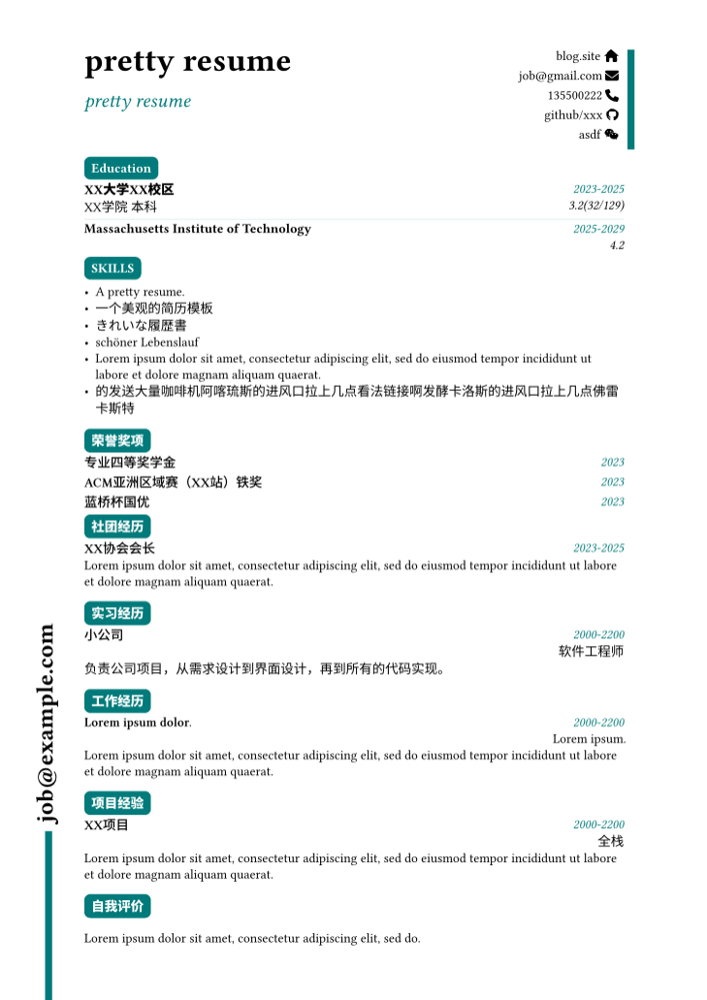
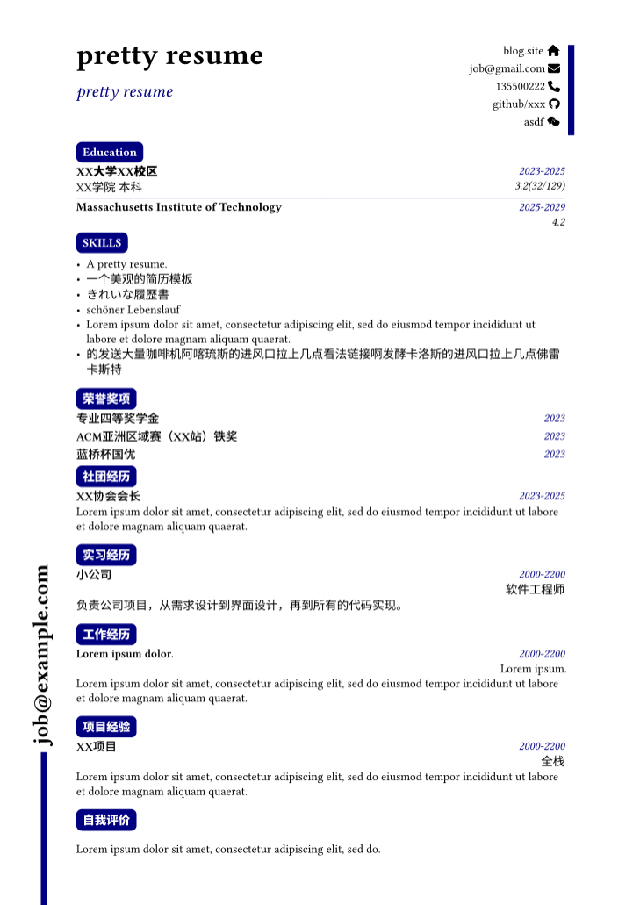

#  typst-resume-template

[中文](./README-zh.md)


This project is a resume template designed using Typst and inspired by [this website](https://satnaing.dev/blog). 

## Preview

|  |  |
|:---:|:---:|
|   |  |

## Usage

The commonly used SVG files are already in the folder `typst`, and the template file is `typst/resume.typ`. Enter your resume content in the file `typst/main.typ`.

### Update page parameters

```typst
#set page(margin: (top: 15mm, bottom: 15mm))

#set text(font: "Linux Libertine", lang: "zh", 1em)

#set par(leading: 0.58em)
```

Including font size, language, top distance, bottom distance and so on.

### Change color

Update the `theme_color` parameter.

### Modify the vertical line

If you want to modify the vertical line, you can find

```typst
line(
    start: (0%, 11.1%),
    end: (0%, 0%),
    length: 4cm,
    stroke: 6pt + theme_color,
)
```

to make the changes.


### dividing_line

Divider, which can be used to separate sections for multiple educational qualifications.

## License
Format is MIT but all the data is owned by hexWars
