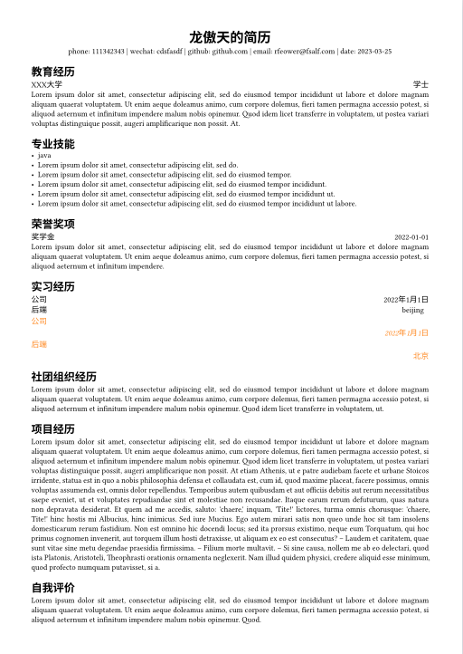
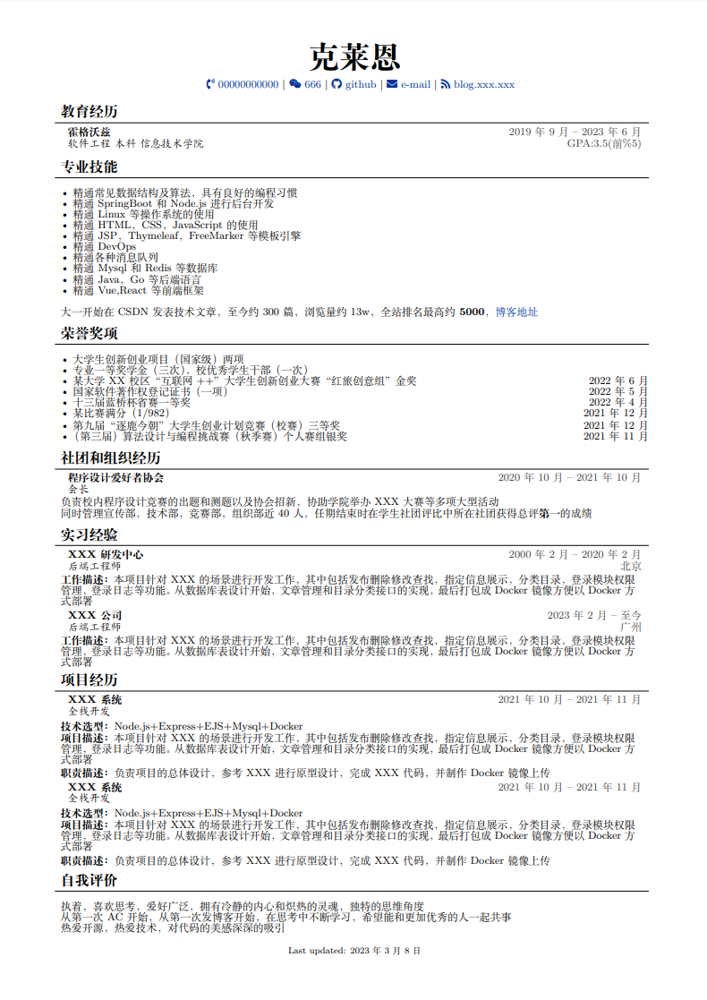

todo：尝试用typst写一遍)

我看了一下语法好简单的...

大概写出来是这样，不过还没加颜色，有点意思

---

一个适合中文的，简单的latex简历模板

之前用的感觉不够美观，其他人的改起来麻烦（因为我的比较满）遂自己做了一个，样式参考了[该简历](https://www.overleaf.com/latex/templates/autocv/scfvqfpxncwb)，虽然样式差不多但是实现的代码不太一样，细节倒是也有不少地方不满意

# 修改解释

我将大部分的配置放在了`resume.sty`文件夹中，后面或许会修改

图标替换请到[网站](https://fontawesome.com/icons)中寻找并替换

修改全局字体大小和行间距`{\fontsize{Xpt}{Xpt}\selectfont`

对一些小地方的行间距不满意的话就修改`\vspace{Xpt}`，我感觉用的比较频繁

自动换行的问题，我是靠`minipage`解决的，后面一个参数就是长度，自行修改即可

# Preview

# License
Format is MIT but all the data is owned by hexWars
